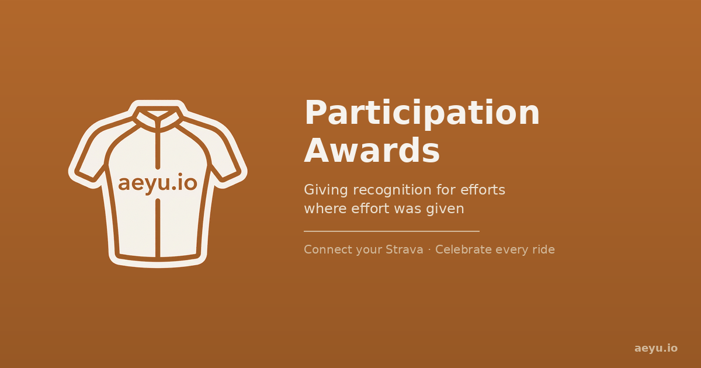

<p align="center">
  
</p>

# aeyu.io — Participation Awards

**Giving recognition for efforts where effort was given.**

A client-side cycling awards app that connects to [Strava](https://www.strava.com/) and surfaces achievements Strava doesn't offer: year bests, season firsts, consistency streaks, comeback tracking, power curve milestones, and more. All data stays in your browser — no backend stores user data.

🚴 **Live at [aeyu.io](https://aeyu.io)** · [Try the demo](https://aeyu.io/#demo)

---

## How It Works

1. Connect your Strava account via OAuth
2. Activities and segment efforts sync into your browser's IndexedDB
3. An awards engine analyzes your history and computes 26+ award types
4. Awards appear on your dashboard and per-activity detail views, with shareable cards

The only server component is a small Cloudflare Worker that proxies OAuth token exchange (Strava requires a server-side `client_secret`). Everything else — data storage, award computation, rendering — runs entirely in the browser as a PWA.

## Self-Hosting Guide

Want to run your own instance? Here's everything you need.

### Prerequisites

- A [Strava API application](https://www.strava.com/settings/api) (free)
- A [Cloudflare account](https://dash.cloudflare.com/sign-up) (free tier is fine)
- A static hosting provider (GitHub Pages, Netlify, Vercel, or any static host)
- [Wrangler CLI](https://developers.cloudflare.com/workers/wrangler/install-and-update/) for deploying the worker

### Step 1: Register a Strava API App

Go to [strava.com/settings/api](https://www.strava.com/settings/api) and create an application:

- **Application Name:** Whatever you'd like
- **Category:** Training
- **Website:** Your hosting URL (e.g., `https://yourdomain.com`)
- **Authorization Callback Domain:** Your domain (e.g., `yourdomain.com`)

This gives you a **Client ID** (public) and a **Client Secret** (private — never expose this in client code).

> **Note:** New Strava apps start in "single player mode" — only one connected athlete. This is fine for personal use. To support multiple users, email `developers@strava.com` with your app ID and Strava branding compliance screenshots.

### Step 2: Fork and Configure

Fork this repository, then edit `src/config.js` with your values:

```js
export const STRAVA_CLIENT_ID = "YOUR_CLIENT_ID";
export const WORKER_URL = "https://your-worker-name.your-subdomain.workers.dev";
export const OAUTH_REDIRECT_URI = "https://yourdomain.com/callback.html";
```

The other constants (`STRAVA_AUTH_URL`, `STRAVA_API_BASE`, `OAUTH_SCOPE`) don't need changes.

### Step 3: Deploy the OAuth Worker

The worker proxies token exchange so your `client_secret` stays server-side:

```bash
cd worker
wrangler login
wrangler secret put STRAVA_CLIENT_ID    # paste your Client ID
wrangler secret put STRAVA_CLIENT_SECRET # paste your Client Secret
wrangler deploy
```

Note the deployed URL — it should match what you put in `config.js`.

If you're hosting on a different domain than `aeyu.io`, update the `ALLOWED_ORIGINS` array in `worker/worker.js` to include your domain and any local development origins.

### Step 4: Deploy the Frontend

**GitHub Pages:** Push to `main` with GitHub Pages enabled on the repo. Add a `CNAME` file with your domain if using a custom domain.

**Any static host:** Just deploy the root directory. There's no build step — all files serve as-is. The app uses ESM imports from CDN (Preact, HTM, Signals, Tailwind).

**Local development:** Serve the root directory with any static server:
```bash
python3 -m http.server 5500
# or
npx serve .
```
Then visit `http://localhost:5500`. The worker CORS config already allows localhost origins on ports 3000 and 5500.

### Step 5: Connect and Ride

Visit your deployed URL, click "Connect with Strava," and authorize. Your first sync will backfill your activity history — this may take several sessions due to Strava API rate limits (100 requests per 15 minutes, 1000 per day). The sync is resumable and picks up where it left off.

## Architecture

```
Frontend (100% client-side, no build step)
├── index.html              App shell
├── callback.html           OAuth redirect handler
├── src/
│   ├── app.js              Hash-based router, init
│   ├── auth.js             OAuth flow, token management
│   ├── config.js           Public configuration
│   ├── db.js               IndexedDB wrapper
│   ├── sync.js             Strava API sync with rate limiting
│   ├── awards.js           Award computation engine (26+ types)
│   ├── award-config.js     Award labels, colors, tiers
│   ├── power-curve.js      Power curve analysis
│   ├── units.js            Metric/imperial formatting
│   ├── demo.js             Demo mode with canned data
│   ├── icons.js            SVG icons as Preact components
│   └── components/
│       ├── Landing.js      Pre-auth landing page
│       ├── Dashboard.js    Main screen
│       └── ActivityDetail.js  Per-activity view + share cards
├── sw.js                   Service worker (PWA offline)
└── manifest.json           PWA manifest

Backend (Cloudflare Worker — OAuth proxy only)
└── worker/
    ├── worker.js           Token exchange + refresh endpoints
    └── wrangler.toml       Worker configuration

Testing
└── test/
    ├── harness.py          Playwright-based test harness
    ├── setup.sh            Vendor bundle bootstrap
    └── fixture-real.json   Real data fixture (not for redistribution)
```

### Tech Stack

- **Preact + HTM + Signals** — reactive UI with no build step, ESM imports from CDN
- **IndexedDB** — all user data stored locally in the browser
- **Tailwind CSS** — via CDN
- **Cloudflare Workers** — OAuth proxy (free tier)
- **GitHub Pages** — static hosting (or any static host)

### Key Design Decisions

**No backend stores user data.** Privacy by architecture. Your Strava data never leaves your browser. The worker only touches OAuth tokens in transit.

**No build step.** Edit a JS file, push, done. Import maps resolve Preact/HTM/Signals from `esm.sh`. Tailwind loads from CDN. This keeps the development loop as simple as possible.

**Resumable sync.** Strava rate limits are real. Sync state persists in IndexedDB so backfill can span multiple sessions without re-fetching.

**CV filter.** Segments with high time variance (coefficient of variation > 0.5) suppress most awards, preventing noisy segments like traffic-light intersections from generating meaningless achievements.

## Award Types

The engine computes segment-level and ride-level awards including: year bests, season firsts, recent bests (30/60/90-day), beat-median, top quartile and decile performances, consistency streaks, monthly bests, improvement streaks, comebacks, milestones, best month ever, closing-in-on-PR, anniversary rides, YTD bests for both time and power, and reference bests. Comeback mode adds additional tracking for returning from breaks.

See `src/award-config.js` for the full catalog with labels, colors, and tier rankings.

## Running Tests

The test harness uses Playwright to inject mock data and verify award computation:

```bash
bash test/setup.sh          # one-time: build vendor bundles
python3 test/harness.py     # run test scenarios
```

Requires Node.js (for esbuild/Tailwind bundling) and Python 3 with Playwright installed.

## Contributing

Issues and pull requests are welcome. The codebase has `_MAP.md` files in each directory that document all exports with signatures and line numbers — start there rather than reading source files top to bottom.

For development context, see `CLAUDE.md` which contains architecture notes, patterns, and gotchas.

## License

[MIT License](LICENSE) — free to use, modify, and distribute with attribution.

Copyright (c) 2025-2026 [Oskar Austegard](https://austegard.com)

If you build something with this, a link back to [aeyu.io](https://aeyu.io) or this repo is appreciated.

## Acknowledgments

Built with [Claude](https://claude.ai) by Anthropic. The entire codebase — from spec to implementation to the awards engine to this README — was developed through human-AI collaboration.

Strava and the Strava API are trademarks of Strava, Inc. This project is not affiliated with or endorsed by Strava.
